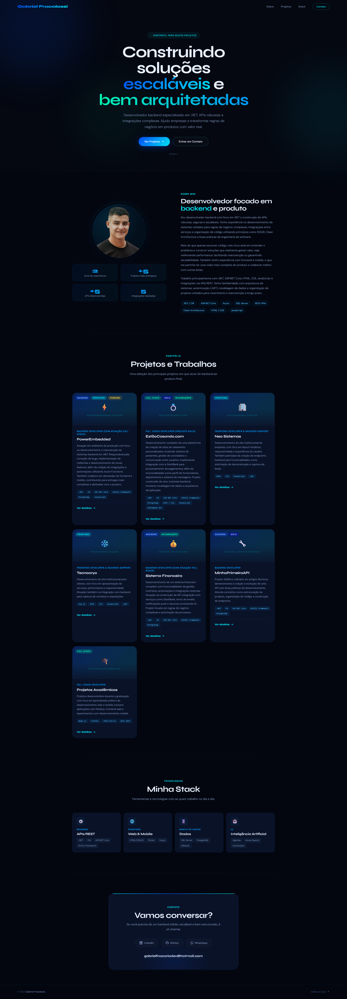

# Portfólio — Gabriel Fracalossi

Site de portfólio pessoal desenvolvido com HTML, CSS e JavaScript puro.

## Stack

- HTML5
- CSS3 (variáveis, animações, grid, flexbox)
- JavaScript vanilla (sem frameworks)
- Google Fonts: Syne + DM Sans

## Estrutura

```
├── index.html
├── style.css
└── main.js
```

## Seções

- **Hero** — apresentação com badge animado e chamadas para ação
- **Sobre** — bio, stats e stack de tecnologias
- **Projetos** — cards com filtro por categoria (Backend, Frontend, Full Stack)
- **Stack** — tecnologias organizadas por área
- **Contato** — links para LinkedIn, GitHub e WhatsApp

## Preview

